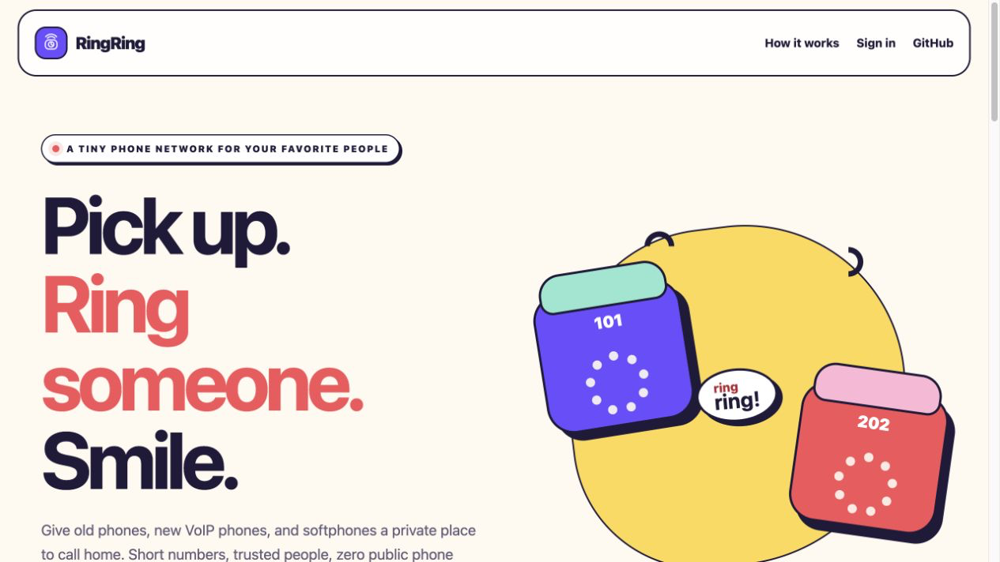
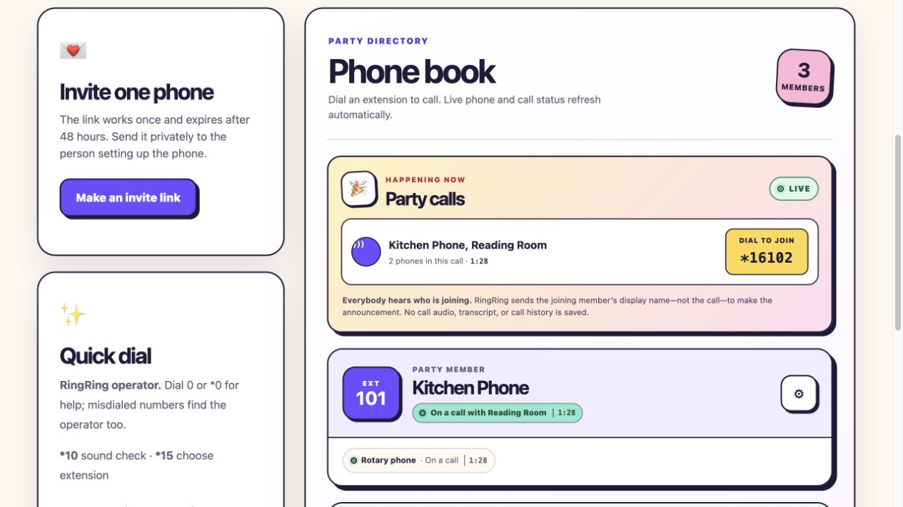

# RingRing

**Private phone parties for families.**

RingRing turns SIP phones, softphones, and ordinary telephones connected through SIP-to-FXS adapters into a tiny private phone network. Create a party, invite the people you trust, choose short extensions, and call one another—without connecting to the public telephone network.

The hosted reference instance is live at [ringring.live](https://ringring.live).

> [!IMPORTANT]
> RingRing cannot place emergency calls or reach regular phone numbers. Keep another way to contact emergency services available.

## A quick look

[](https://ringring.live)

The hosted front door keeps the promise simple: pick up, ring someone, smile.



The host phone book updates automatically. It shows registration and call activity, friendly participant names, live elapsed time, and a short `*16` code that lets another party phone join the conversation.

## What we are building

- Isolated parties with a host and a private extension directory.
- One-time invite links with a private scan-to-join QR that native apps can finish with an extension choice, plus independently revocable setup cards for every ATA, desk phone, or app, universal links on the reference iPhone app, and a documented vendor-neutral phone API.
- Copy-ready manual setup guidance that translates common ATA, VoIP-phone, and softphone field labels.
- A bright, mobile-first host dashboard for invitations, members, live per-phone call state and elapsed time, active party calls, announced call joining, one-tap incoming ring checks, device controls, and optional lines.
- An always-available RingRing operator on `0`/`*0`, `*10` two-way phone testing, and `*15` voice-guided extension selection, plus optional time, weather, internet radio, and joinable in-progress party calls.
- A reproducible, self-hosted Docker Compose deployment using Asterisk and Caddy.

See [the architecture](docs/ARCHITECTURE.md), [the phone API](docs/PHONE_API.md), [the security model](docs/SECURITY.md), [privacy-preserving observability](docs/OBSERVABILITY.md), [SIP TLS compatibility](docs/SIP_TLS_COMPATIBILITY.md), [backup and recovery](docs/RECOVERY.md), and [the roadmap](docs/ROADMAP.md).

iPhone users can also read the app's [privacy notice](docs/PRIVACY.md) and [support guide](docs/SUPPORT.md).

## Self-hosting

On a clean Debian or Ubuntu server with Docker Engine and Compose v2, clone the public repository into `/opt/ringring`, copy the root-only [answers template](deploy/install.answers.example) outside the checkout, and run `sudo ./ringringctl install --answers /root/ringring-install.answers`. Secrets are accepted only through that private file or hidden terminal prompts—not command-line flags. The command generates independent deployment keys, configures the SIP firewall before starting public listeners, starts the full stack, and verifies the private and public health checks.

`sudo /opt/ringring/ringringctl upgrade` performs an exact fast-forward upgrade with drilled pre- and post-upgrade backups. `sudo /opt/ringring/ringringctl doctor` provides a read-only deployment check. See the [deployment guide](docs/DEPLOYMENT.md) for prerequisites, dry runs, interrupted-operation recovery, existing manual deployment adoption, and advanced manual steps.

## Status

The core private-phone flow is live: hosts can create and safely retire parties, issue a one-time member link that can be copied or scanned from a private QR, see and cancel unused links after a mistaken share, add several separately credentialed phones to one member and ring them on the same extension, see whether each phone is registered and reachable, rotate or revoke individual SIP credentials, replace and revoke a party's OpenAI runtime key, set its bounded hard monthly AI spend limit, delete their host account, scan a one-time RingRing or Linphone setup QR, download a complete themed Grandstream WP826 setup file with an auto-updating private phonebook, use the OpenAPI-described phone endpoint, or follow manual setup guides for ATAs, VoIP phones, and other softphones. New and rotated phones get a 6-digit SIP username and a 12-digit password; the database retries the short username on a collision, and the setup card groups both values for reading while copy/provisioning uses the exact unspaced digits. A successful new member also gets a private first-call card with members whose phone remains connected to the party and the special lines currently enabled. Hosts sign up immediately with a RingRing username, password, shared family access code, and offline recovery codes—Google and email confirmation are not required.

Every party has a private RingRing operator on `0` and `*0`, plus a `*10` echo test that lets one phone prove its microphone, speaker, and two-way media path. A short bundled “Ring ring! RingRing here!” recording starts immediately while the fixed, code-controlled operator response is loaded or generated with the party’s OpenAI text-to-speech key. The operator gives a short tour using only services enabled for that party and also explains misdialed numbers and unavailable phones or services. RingRing sends no caller audio, dialed digits, names, or SIP credentials for these prompts, caches the generated WAV files, and falls back to bundled Asterisk audio whenever OpenAI is unavailable. A compatible ATA can auto-dial `0` or `*0` after an 8–10 second off-hook delay; the tested Grandstream HT801 V2 uses `*0`.

The host-only phone book refreshes registration and current call activity without a full page reload. It distinguishes off hook, calling, ringing, and on-call phones; shows friendly same-party companion names and bounded elapsed time; and lists active party calls with one-tap join controls. A joining phone enters the existing party-scoped conference after RingRing's fixed friendly voice announces its validated member name. RingRing does not persist this activity, record the call, or expose caller ID, dialed digits, channel identifiers, addresses, or exact timestamps.

Once a device is online, its host can send a rate-limited internal setup call so that phone rings and speaks its extension—no second phone or public telephone route is needed. Dialing `*15` lets the authenticated phone enter a new 2–5 digit extension, hear it repeated, and press `1` to save without changing SIP credentials. Party-scoped `*11` time, `*12` weather, and host-selected `*13` internet radio are deployed alongside automated per-party OpenAI key provisioning for one-way speech. The time line starts with the bundled greeting while the friendly party voice prepares the current local time and date, caches only that spoken minute, and falls back to Asterisk's local voice if provider speech is unavailable. Each member keeps a separate weather place shared only by the phones on that extension. When `*12` does not know that member's place, its friendly voice asks the authenticated phone for a five-digit U.S. ZIP, resolves and saves it, then immediately reads the forecast; the host can also set or clear the member's city, state, or postal code from the member gear. Keypad setup records no caller audio and sends no transcript to OpenAI. Radio choices come from a small code-controlled SomaFM catalog; arbitrary URLs never enter the database or Asterisk dialplan. Answered member calls become private party conferences: dialing the called extension again joins the conversation, and the RingRing operator announces the authenticated joining member. The iPhone app shows those calls above its secondary service buttons and offers one-tap joining. Party deletion archives its external OpenAI project before local credentials are removed. Isolated smoke tests verify authenticated SIP TLS 1.2 and compatibility-UDP registration, host-added same-extension routing, the host-triggered incoming ring, mixed-transport party calling and three-phone joining, party-scoped operator and bundled fallback behavior, `*10` echo, bidirectional PCMU media, authenticated `*15` DTMF selection and live route replacement, the complete radio catalog in the production Asterisk image, two private phone networks with distinct NAT identities, official Linphone-engine provisioning with certificate and hostname verification, checksummed backup/restore with credential decryption, and guarded member/party/account deletion. The reference instance remains a preview until two remote physical devices pass a real two-way-audio call.

The public repository intentionally contains no deployment credentials or family data. Internal aggregate metrics contain no family/device/caller labels or call content, reset with the app, and are not published through Caddy. The iOS endpoint uses an encrypted, device-scoped VoIP push registration to wake through PushKit, reports the call through CallKit before refreshing SIP, and receives only an opaque call UUID through Apple. Background and locked-screen delivery still requires acceptance testing on a physical iPhone; a force-quit remains under iOS control and is never promised.

## Development

Requirements:

- Go (version in `go.mod`)
- Docker with Compose for the full VoIP stack
- `make`

Project commands:

```sh
cp .env.example .env
make setup
make dev
make test
make check
make security
make admin-test
make sip-smoke
make sip-tls-smoke
make nat-smoke
make linphone-smoke
make radio-smoke
make compose-up
```

RingRing runs its release checks locally instead of on GitHub-hosted CI runners. Before publishing a candidate, run `make check`, `make security`, and `make admin-test` on a trusted development machine and record the result in `WORKLOG.md`. Pull requests remain useful for review, but GitHub does not execute repository code automatically.

`make sip-smoke` builds RingRing plus the pinned Asterisk and source-checksummed SIPp images, seeds a disposable two-phone database, and places the complete app, PBX, and clients on an internal Docker network. A disposable CA proves TLS 1.2 certificate and hostname verification. One phone uses TLS, the compatibility phone uses UDP, and the pair must register, call, exchange PCMU audio, receive answered spoken failures for an invalid extension and disabled star line, complete `*10`, and finish an authenticated `*15` DTMF interaction that changes `101` to `103` without changing the SIP credential. It reads no application environment or production database, publishes no host ports, and removes its containers, network, database, keys, and generated state when finished. If the Docker runtime cannot bind-mount host `/tmp`—as with a default Colima VM—set `RINGRING_SMOKE_TMP_ROOT` to an existing host directory that Docker shares before running the command.

`make nat-smoke` puts two SIPp phones in separate private Linux network namespaces with distinct SNAT identities. Both register private contacts, call through RingRing's generated party dialplan, and exchange independently generated PCMU streams through Asterisk; the test requires rewritten public contacts and more than 100 media packets across each NAT in each direction. Its privileged topology container is disposable, receives no Docker socket or production mounts, publishes no ports, and is removed on exit.

`make linphone-smoke` downloads a checksum-pinned official GPLv3 Linphone Python wheel into a test-only image, gives it a disposable CA, and asks that engine to fetch TLS account XML generated by RingRing's production code. Linphone must explicitly verify the server certificate and hostname, register extension `101`, and call disposable extension `102`. The test requires both contacts to be reachable, the generated party dialplan, more than 100 RTP packets in each direction, an allowed codec, and the expected 440 Hz tone in Linphone's returned-audio recording. Runtime stays on a disposable internal network with fixed smoke-only credentials and no production state or published ports. `make sip-tls-smoke` runs this test after `make sip-smoke`; the large Linphone image is not part of RingRing's production images.

`make radio-smoke` passes the application binary's complete code-controlled station catalog to a disposable production Asterisk image. Every URL must match the narrow SomaFM MP3 allowlist and deliver decodable MPEG Layer III audio for five seconds. The check receives no deployment environment, production state, family credential, or host port and removes its two exact test images on exit.

## Contributing

Read [AGENTS.md](AGENTS.md) before making changes and record meaningful work in [WORKLOG.md](WORKLOG.md). Issues and small, focused pull requests are welcome once the initial vertical slice lands.

## License

[MIT](LICENSE). QR-encoding dependency notices are included in [THIRD_PARTY_NOTICES.md](THIRD_PARTY_NOTICES.md).
